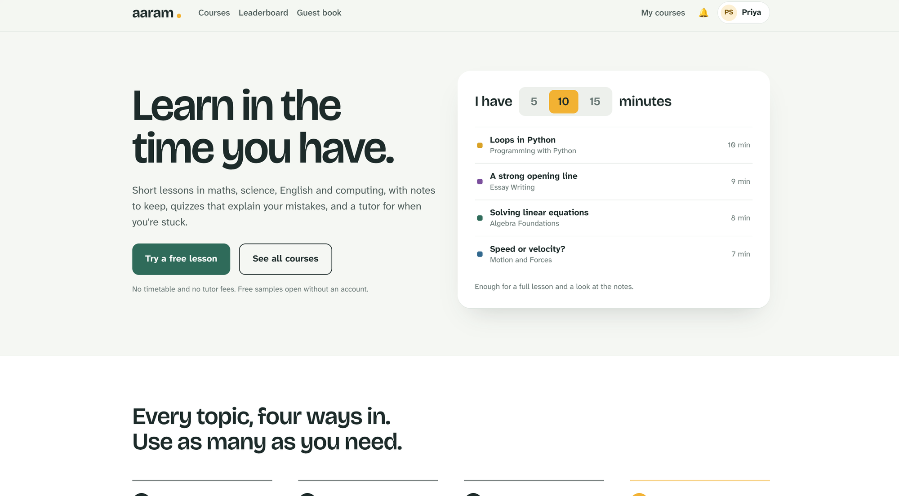
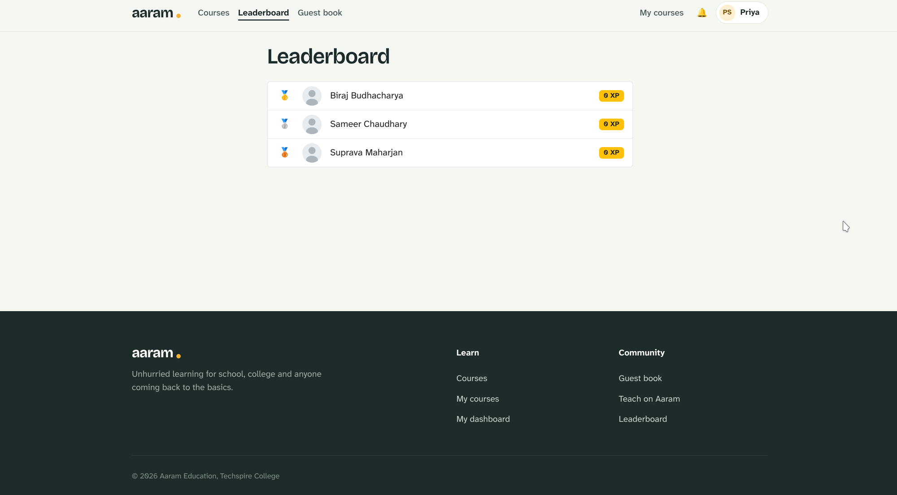
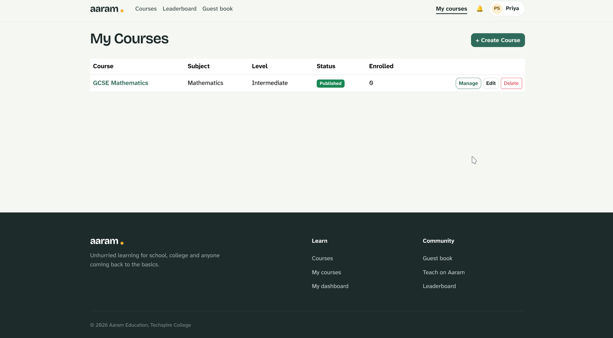

# aaram — stress-free online learning

A course platform for short, self-paced lessons: watch a video, read the notes, take a
practice quiz, ask a tutor. Built as an ASP.NET Core 10 MVC app for students, tutors,
and admins.



---

## Tech stack

| Layer | Technology |
|---|---|
| Framework | ASP.NET Core 10 MVC + Razor Views (`.cshtml`) |
| ORM | Entity Framework Core 9 (Pomelo MySQL provider) |
| Database | MySQL / MariaDB |
| Auth | Custom `User` entity + cookie authentication (not ASP.NET Identity) |
| Passwords | BCrypt.Net-Next |
| Config | `.env` via DotNetEnv |
| Styling | Custom design system (`wwwroot/css/aaram.css`) + Bootstrap 5 (layout utilities only) |
| Fonts | Bricolage Grotesque (headings), Atkinson Hyperlegible Next (body) |
| Tests | xUnit, EF Core InMemory + SQLite providers |

Auth is a hand-rolled cookie scheme, not `Microsoft.AspNetCore.Identity` — `User` is a
plain EF entity with a `PasswordHash` column.

---

## Features

- **Courses** — subject/difficulty filters, modules → lessons, free-sample lessons
  open without an account.
- **Lessons** — video player (YouTube embed or `<video>`), resumable playback position,
  downloadable study notes, per-lesson practice quiz.
- **Quizzes** — multiple choice, true/false, short answer; scored on submit with
  per-question feedback; capped attempts.
- **Progress** — lesson → module → course completion rolls up automatically; student
  dashboard shows XP, streaks, enrolled courses, recent activity.
- **Gamification** — badges awarded on threshold (lessons completed, quizzes passed,
  streak days, courses completed); XP leaderboard.
- **Guestbook** — public messages, moderated by admins before showing.
- **Notifications** — in-app bell with unread count (badge earned, new content, etc).
- **Tutor tools** — create/edit courses, modules, and lessons; upload videos and notes;
  build quizzes; see enrollment counts.
- **Admin tools** — manage users, publish/unpublish any course, moderate the guestbook.

---

## Screenshots

| | |
|---|---|
|  |  |
| Home — "I have N minutes" picks a lesson that fits | Leaderboard — XP ranking with medals |
|  | |
| Tutor dashboard — manage, edit, or unpublish a course | |

---

## Repository structure

```
aaram-education/
├── src/
│   ├── AaramEducation.Web/              # MVC app (entry point)
│   │   ├── Controllers/
│   │   │   ├── HomeController.cs        # Landing page
│   │   │   ├── AccountController.cs     # Register / Login / Logout / Profile
│   │   │   ├── CoursesController.cs     # Catalog, details, enroll/drop
│   │   │   ├── LessonsController.cs     # Watch lesson, save/complete progress
│   │   │   ├── QuizController.cs        # Start / take / submit / results
│   │   │   ├── ProgressController.cs    # Student dashboard
│   │   │   ├── BadgesController.cs      # Badge list + leaderboard
│   │   │   ├── TutorController.cs       # [Authorize(Roles="Tutor")] course/module/lesson CRUD
│   │   │   ├── AdminController.cs       # [Authorize(Roles="Admin")] users/courses/guestbook
│   │   │   ├── GuestbookController.cs   # Submit + list approved entries
│   │   │   └── NotificationsController.cs
│   │   ├── Views/                       # One folder per controller, plus Shared/
│   │   ├── Components/NavbarNotifications/  # Notification bell ViewComponent
│   │   ├── Models/ViewModels/            # Page-specific view models
│   │   ├── wwwroot/
│   │   │   ├── css/aaram.css             # Design system (tokens, components, layout)
│   │   │   ├── js/                       # lesson-player.js, site.js
│   │   │   └── uploads/{avatars,videos,notes}/
│   │   └── Program.cs
│   │
│   ├── AaramEducation.Core/              # Domain layer — no EF/infra dependency
│   │   ├── Entities/                     # User, Course, Module, Lesson, Video, StudyNote,
│   │   │                                 # Quiz, QuizQuestion, AnswerOption, QuizAttempt,
│   │   │                                 # QuestionResponse, Enrollment, CourseProgress,
│   │   │                                 # ModuleProgress, LessonProgress, Badge, UserBadge,
│   │   │                                 # DailyActivityLog, GuestbookEntry, Notification
│   │   ├── Enums/                        # UserRole, EnrollmentStatus, ProgressStatus,
│   │   │                                 # AttemptStatus, ModerationStatus, QuestionType
│   │   └── Interfaces/                   # I*Repository contracts
│   │
│   ├── AaramEducation.Infrastructure/    # EF Core + repository implementations
│   │   ├── Data/
│   │   │   ├── ApplicationDbContext.cs   # 20 DbSets, Fluent API config
│   │   │   ├── Seed/DbSeeder.cs          # Dev-only seed data (see Test users below)
│   │   │   └── Migrations/
│   │   └── Repositories/                 # One per aggregate (Course, Enrollment, Lesson,
│   │                                      # Progress, Quiz, Guestbook, Badge, Notification, User)
│   │
│   └── AaramEducation.Tests/             # xUnit — badge thresholds, quiz submit, progress rollup
│
├── ERD.md                                 # Source-of-truth entity relationship diagram
├── docs/                                  # Planning docs (architecture, DB design, setup)
└── .env                                   # DB_HOST / DB_PORT / DB_NAME / DB_USER / DB_PASSWORD
```

---

## Getting started

```bash
# 1. Create .env at the repo root
cat > .env <<'EOF'
DB_HOST=localhost
DB_PORT=3306
DB_NAME=aaram_education
DB_USER=root
DB_PASSWORD=password
EOF

# 2. Apply migrations
dotnet ef database update \
  --project src/AaramEducation.Infrastructure \
  --startup-project src/AaramEducation.Web

# 3. Run
dotnet run --project src/AaramEducation.Web
```

App runs at `http://localhost:5287`. In Development, `DbSeeder` seeds test users and
sample courses on startup.

### Test users (dev seed data)

| Role | Email | Password |
|---|---|---|
| Admin | `admin@aaram.edu` | `Admin@1234` |
| Tutor | `tutor1@aaram.edu` | `Tutor@1234` |
| Tutor | `tutor2@aaram.edu` | `Tutor@1234` |
| Student | `student1@aaram.edu` | `Student@1234` |
| Student | `student2@aaram.edu` | `Student@1234` |
| Student | `student3@aaram.edu` | `Student@1234` |

Dev-only — seeding is gated on `app.Environment.IsDevelopment()`, never runs in
production.

---

## Running tests

The real test suite lives at `src/AaramEducation.Tests` (not the `tests/` folder in
the `.slnx`):

```bash
cd src/AaramEducation.Tests
dotnet test
```

---

## Design system

Colors, typography, and component classes are defined once in
[`wwwroot/css/aaram.css`](src/AaramEducation.Web/wwwroot/css/aaram.css):

| Token | Value | Use |
|---|---|---|
| `--aaram-primary` | `#2F6B5A` | Primary buttons, links, brand |
| `--aaram-bg` | `#F5F7F3` | Page background |
| `--aaram-text` | `#1D2B2A` | Body text |
| `--aaram-accent` | `#F2B233` | Gold accent (brand dot, CTA highlight) |
| `--aaram-border` | `#DDE4DF` | Card/section borders |

Headings use **Bricolage Grotesque**; body copy uses **Atkinson Hyperlegible Next**.
The palette is light-only — matches the design reference, no dark mode.

---

## Docs

- [ERD (Mermaid)](ERD.md)
- [Architecture](docs/architecture.md)
- [Database design](docs/database-design.md)
- [Setup guide](docs/setup.md)
